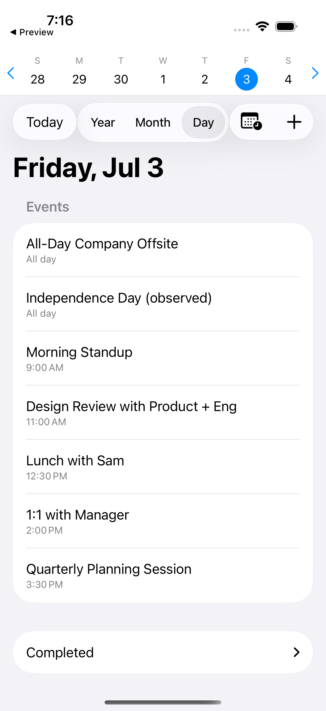
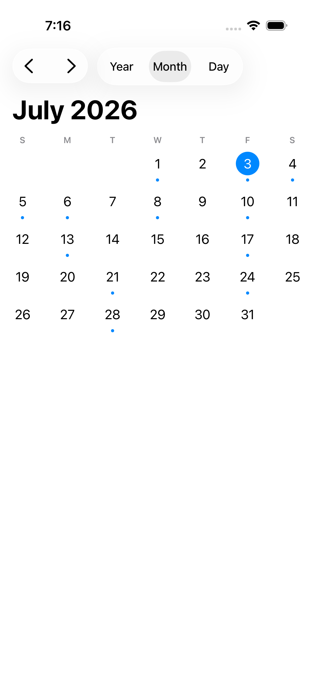

# Calenminder

A native iOS app that treats calendar events and day-scoped tasks as different things - because "bring recycling to curb" is not a 6pm appointment.

- **Events** are time-sensitive, live in Apple Calendar, and get full create/edit/delete with recurring-event support.
- **Tasks** belong to a day, not a time. They can repeat daily or weekly, roll forward when overdue, and get checked off with one tap - in the app or straight from a Lock Screen widget.

| Day view | Month view |
|---|---|
|  |  |

## Features

- Unified agenda: today's events and tasks in one place, with year / month / week / day views and swipe navigation throughout.
- Tasks are Apple Reminders under the hood (a dedicated list), so they sync via iCloud and interop with Siri and the Reminders app for free.
- Lock Screen and Home Screen widgets showing today's events and incomplete tasks, with tap-to-complete.
- App icon badge counting today's incomplete + overdue tasks.
- Declined invites are filtered out; pending invites are marked in-app and excluded from the widget.

## Privacy

Everything runs on device.
There is no network layer in this app - no servers, no analytics, no accounts.
Calendar and Reminders data is read and written exclusively through Apple's EventKit on your device; the required permission prompts are the only gate.
You can verify all of that in this repository.

## Building

Requirements: Xcode 16+ (iOS 17 deployment target), and [XcodeGen](https://github.com/yonaskolb/XcodeGen) if you modify `project.yml` (the committed `Calenminder.xcodeproj` works standalone).

```
make generate   # regenerate the Xcode project from project.yml (source of truth)
make build      # build for the simulator
make test       # unit tests (fast, no system stores)
make test-integration  # EventKit/Reminders integration + UI tests (simulator, serial)
```

To run on a device, set your own `DEVELOPMENT_TEAM` in `project.yml` and regenerate.

## Architecture (short version)

```
CalenminderKit/Domain/   pure models + agenda logic, no I/O (enforced by a static import check)
CalenminderKit/Store/    EventKit-backed stores behind protocol seams (fixture-testable)
CalenminderKit/Agenda/   AgendaService: the single read/mutate path for app + widget
CalenminderKit/Badge/    icon badge counting
Calenminder/UI/          SwiftUI app
CalenminderWidget/       WidgetKit extension (widget-invoked App Intents must live here - see docs/code-standards.md)
```

The `.code-foundations/` directory holds the planning and requirements documents this app was built from; `docs/code-standards.md` records the project conventions and the empirical platform findings collected along the way.

## License

[MIT](LICENSE). The name and icon aren't part of the grant - please ship your fork under your own identity.
